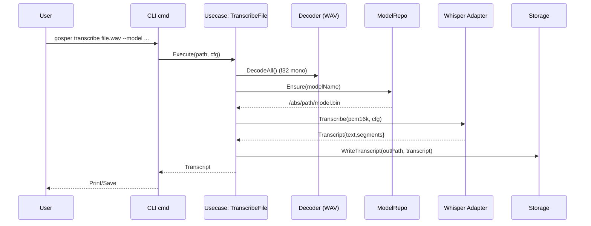

# Architecture

Goal: Hexagonal (ports/adapters) to keep business logic testable and platform concerns isolated.

Core layers
- Domain (`internal/domain`): value objects — Transcript, TranscriptSegment, ModelConfig, AudioFormat, Device
- Ports (`internal/port`): interfaces — Transcriber, AudioInput, ModelRepo, Storage, Logger, Clock
- Use cases (`internal/usecase`): orchestration — TranscribeFile, RecordAndTranscribe, ListDevices
- Adapters (`internal/adapter`): concrete implementations
  - Inbound CLI (Cobra, `-tags=cli`)
  - Outbound Whisper (`-tags=whisper`), wraps whisper.cpp Go bindings
  - Outbound Audio (`-tags=malgo`), mic capture + beep (miniaudio)
  - Outbound Model (cache/download/checksum), Storage (atomic txt/json), Log/Clock

Flow overview
1) File path: decoder → normalize/downmix → resample (16k mono f32) → Transcriber → Storage or stdout
2) Mic path: AudioInput.Open → frames → accumulate until stop → (ensure 16k) → Transcriber → Storage
3) Device selection: ListDevices + robust resolver (id, name, prefix, substring, fuzzy)

Build tags
- `cli` (CLI commands), `whisper` (inference), `malgo` (audio capture/playback)
Tags keep default build lean and tests deterministic.

Mermaid: Component Map

```mermaid
flowchart LR
  U[User] -->|flags, files| CLI[CLI (tags: cli)]
  CLI --> UC[Use Cases]
  subgraph Domain
    UC --> P[Ports]
  end
  P -->|Transcriber| AW[Adapter: Whisper (tags: whisper)]
  P -->|AudioInput| AA[Adapter: Audio In (tags: malgo)]
  P -->|ModelRepo| AM[Adapter: Model Repo]
  P -->|Storage| AS[Adapter: Storage]
  AW --> WhisperCPP[whisper.cpp Go bindings]
  AA --> Miniaudio[miniaudio (malgo)]
  AM --> Cache[(~/.cache/gosper)]
```

Mermaid: Transcribe File Sequence



Mermaid: k3s Deployment (High Level)

```mermaid
flowchart LR
  Browser -->|HTTP| Ingress[Ingress (Traefik)]
  Ingress --> FE[Frontend Service]
  Ingress --> BE[Backend Service]
  FE --> Nginx[nginx static web]
  BE --> Server[Go server /api/transcribe]
  Server --> Whisper[whisper adapter]
  Whisper --> Models[(Model cache)]
  Server -->|optional| HF[HuggingFace models]
```
