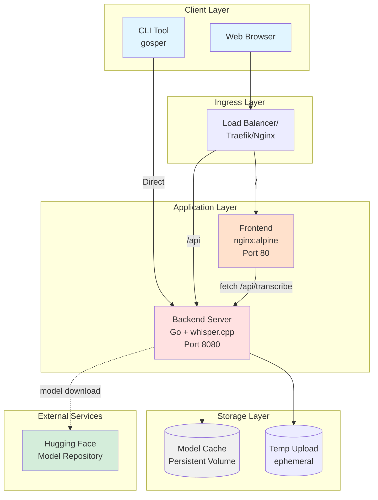
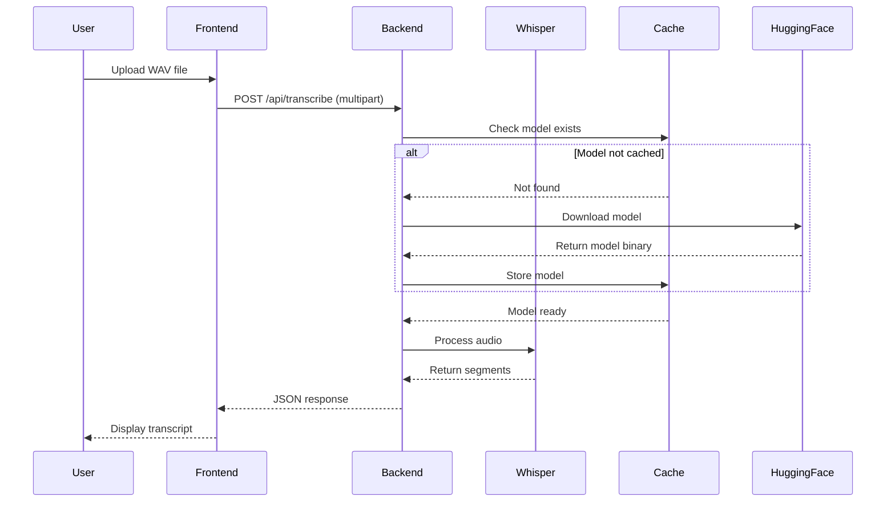
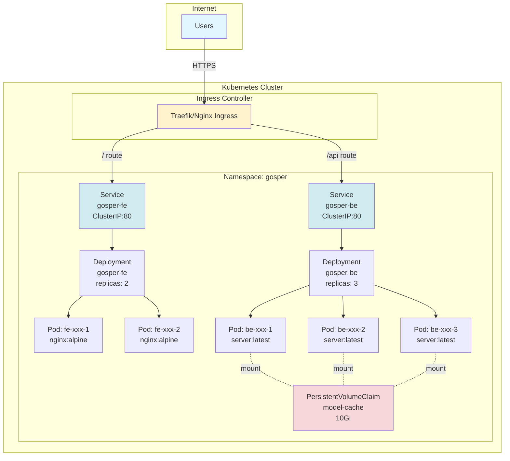
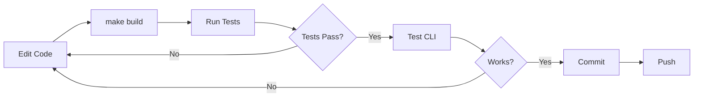
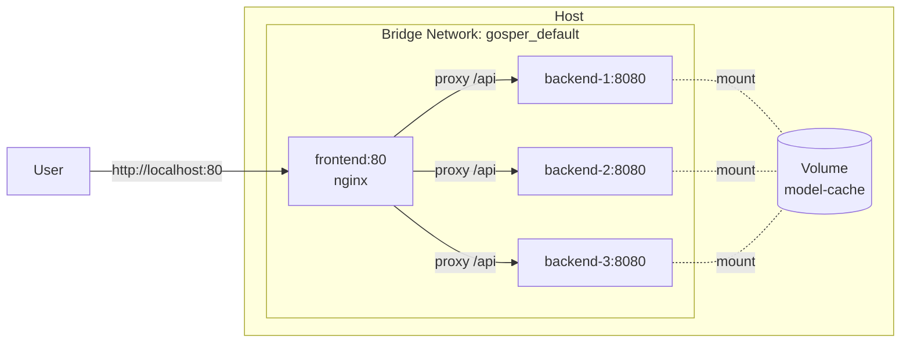
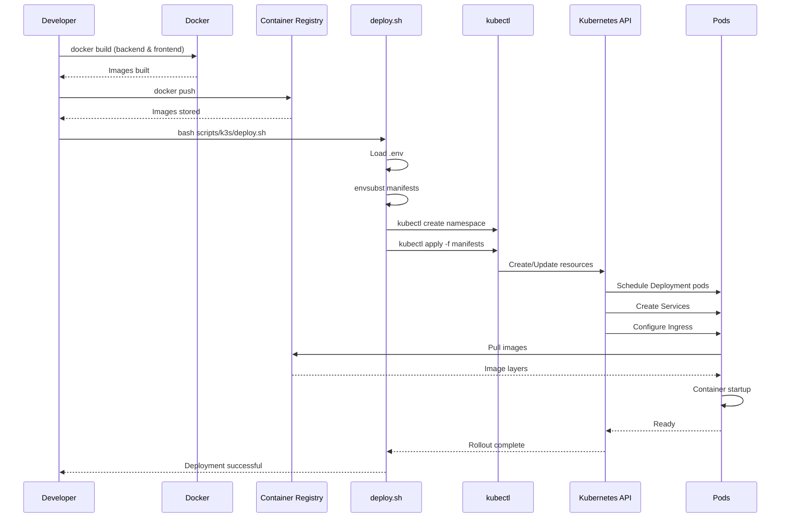
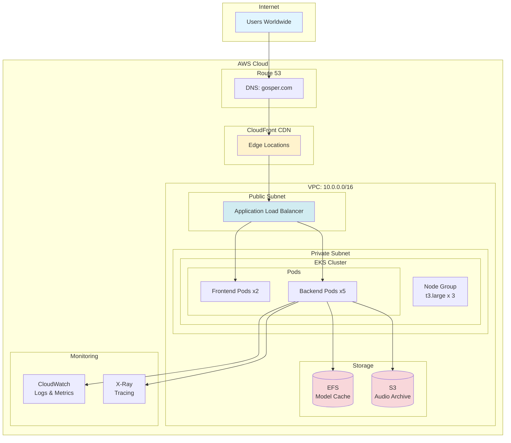
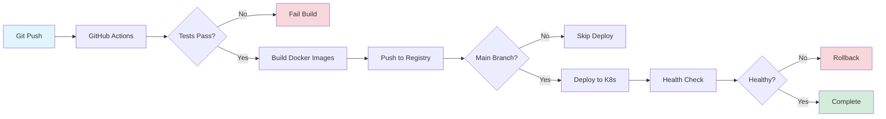
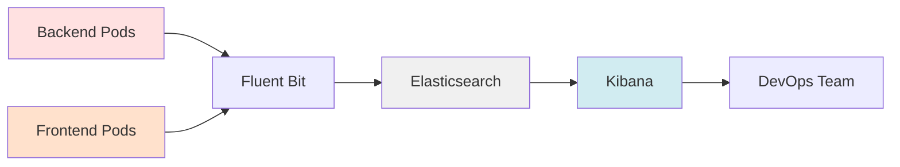
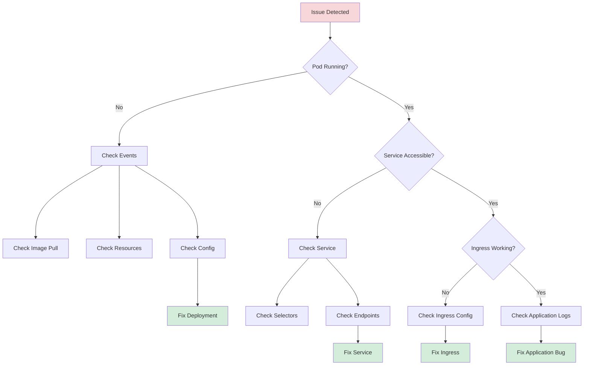

# Complete System Deployment Guide

Comprehensive deployment guide for Gosper speech-to-text system across different environments.

## Table of Contents

1. [Overview](#overview)
2. [Deployment Scenarios](#deployment-scenarios)
3. [Architecture](#architecture)
4. [Local Development](#local-development)
5. [Docker Compose](#docker-compose)
6. [Kubernetes (K3s/K8s)](#kubernetes-deployment)
7. [Production Cloud](#production-cloud)
8. [CI/CD Pipeline](#cicd-pipeline)
9. [Monitoring & Logging](#monitoring--logging)
10. [Security](#security)
11. [Troubleshooting](#troubleshooting)

---

## Overview

Gosper is a distributed speech-to-text application consisting of:

- **CLI Tool**: Local binary for file/mic transcription
- **Backend Server**: HTTP API (`/api/transcribe`) running Go + whisper.cpp
- **Frontend**: Static HTML/JS UI served via nginx
- **Model Repository**: On-demand model download from Hugging Face or local cache

### Deployment Options

| Environment | Use Case | Components | Complexity |
|------------|----------|------------|-----------|
| **Local CLI** | Development, local transcription | CLI binary only | Low |
| **Docker Compose** | Testing, small deployments | Backend + Frontend | Medium |
| **K3s/K8s** | Production, scalability | Full stack + ingress | High |
| **Cloud (AWS/GCP)** | Enterprise, multi-region | Managed K8s + CDN | Very High |

---

## Architecture

### System Architecture (Full Stack)



### Component Interaction



### Deployment Topology (Kubernetes)



---

## Local Development

### Prerequisites

- Go 1.22+
- Make
- C compiler (gcc/clang)
- whisper.cpp submodule

### Build & Run CLI

```bash
# 1. Clone repository
git clone https://github.com/julymeltdown/go-whispher.git
cd go-whispher

# 2. Initialize whisper.cpp submodule
git submodule update --init --recursive

# 3. Build whisper static library
make deps

# 4. Build CLI binary
make build
# Output: dist/gosper

# 5. Run transcription
./dist/gosper transcribe audio.wav \
  --model ggml-tiny.en.bin \
  --lang en \
  -o transcript.txt
```

### Environment Variables

```bash
export GOSPER_MODEL=ggml-base.en.bin
export GOSPER_LANG=auto
export GOSPER_THREADS=4
export GOSPER_CACHE=$HOME/.cache/gosper/models
export GOSPER_LOG=debug
```

### Development Workflow



---

## Docker Compose

### Quick Start

```yaml
# docker-compose.yml
version: '3.8'

services:
  backend:
    build:
      context: .
      dockerfile: Dockerfile.server
    ports:
      - "8080:8080"
    environment:
      - GOSPER_MODEL=ggml-tiny.en.bin
      - GOSPER_LANG=en
      - MODEL_BASE_URL=https://huggingface.co/ggerganov/whisper.cpp/resolve/main
    volumes:
      - model-cache:/root/.cache/gosper/models
    healthcheck:
      test: ["CMD", "curl", "-f", "http://localhost:8080/healthz"]
      interval: 30s
      timeout: 10s
      retries: 3

  frontend:
    build:
      context: .
      dockerfile: Dockerfile.frontend
    ports:
      - "80:80"
    depends_on:
      - backend

volumes:
  model-cache:
```

### Deploy

```bash
# Build and start
docker-compose up -d --build

# View logs
docker-compose logs -f backend

# Scale backend
docker-compose up -d --scale backend=3

# Stop
docker-compose down

# Clean volumes
docker-compose down -v
```

### Docker Compose Architecture



---

## Kubernetes Deployment

### Prerequisites

- Kubernetes cluster (K3s, K8s, EKS, GKE, AKS)
- kubectl configured
- Docker registry access (Docker Hub, GHCR, ECR)

### K3s Local Setup

```bash
# Install K3s (Linux/macOS)
curl -sfL https://get.k3s.io | sh -

# Verify
kubectl get nodes

# Access config
export KUBECONFIG=/etc/rancher/k3s/k3s.yaml
```

### Build & Push Images

```bash
# 1. Build images
docker build -f Dockerfile.server -t ghcr.io/yourusername/gosper-server:v1.0.0 .
docker build -f Dockerfile.frontend -t ghcr.io/yourusername/gosper-fe:v1.0.0 .

# 2. Login to registry
echo $GITHUB_TOKEN | docker login ghcr.io -u yourusername --password-stdin

# 3. Push images
docker push ghcr.io/yourusername/gosper-server:v1.0.0
docker push ghcr.io/yourusername/gosper-fe:v1.0.0
```

### Configure Deployment

```bash
# 1. Copy environment template
cp scripts/k3s/env.example scripts/k3s/.env

# 2. Edit configuration
cat > scripts/k3s/.env <<EOF
export NAMESPACE=gosper-prod
export DOMAIN=gosper.example.com

export BE_IMAGE=ghcr.io/yourusername/gosper-server:v1.0.0
export FE_IMAGE=ghcr.io/yourusername/gosper-fe:v1.0.0

# Optional: registry credentials
export REGISTRY_USER=yourusername
export REGISTRY_PASS=ghp_xxxxxxxxxxxxx
EOF
```

### Deploy to Kubernetes

```bash
# Deploy using script
bash scripts/k3s/deploy.sh

# Manual deployment
source scripts/k3s/.env
export NAMESPACE DOMAIN BE_IMAGE FE_IMAGE

# Create namespace
kubectl create namespace $NAMESPACE

# Apply manifests
for f in deploy/k8s/base/*.yaml; do
  envsubst < "$f" | kubectl apply -n $NAMESPACE -f -
done

# Wait for rollout
kubectl rollout status deployment/gosper-be -n $NAMESPACE
kubectl rollout status deployment/gosper-fe -n $NAMESPACE

# Check status
kubectl get all -n $NAMESPACE
```

### Access Application

```bash
# Get ingress IP
kubectl get ingress -n gosper-prod

# Add to /etc/hosts (if using local domain)
echo "192.168.1.100 gosper.example.com" | sudo tee -a /etc/hosts

# Visit
open http://gosper.example.com
```

### Kubernetes Deployment Flow



### Scale & Update

```bash
# Scale backend
kubectl scale deployment/gosper-be --replicas=5 -n gosper-prod

# Update image
kubectl set image deployment/gosper-be \
  server=ghcr.io/yourusername/gosper-server:v1.0.1 \
  -n gosper-prod

# Rollback
kubectl rollout undo deployment/gosper-be -n gosper-prod

# Check rollout history
kubectl rollout history deployment/gosper-be -n gosper-prod
```

### Persistent Storage

```yaml
# deploy/k8s/base/pvc.yaml
apiVersion: v1
kind: PersistentVolumeClaim
metadata:
  name: model-cache
  namespace: ${NAMESPACE}
spec:
  accessModes:
    - ReadWriteMany
  resources:
    requests:
      storage: 10Gi
  storageClassName: local-path  # or your storage class
```

Mount in backend deployment:

```yaml
# deploy/k8s/base/backend.yaml (add to spec.template.spec)
volumes:
  - name: model-cache
    persistentVolumeClaim:
      claimName: model-cache

# Add to container spec
volumeMounts:
  - name: model-cache
    mountPath: /root/.cache/gosper/models
```

---

## Production Cloud

### AWS Deployment (EKS)

#### Architecture



#### Setup Steps

```bash
# 1. Create EKS cluster
eksctl create cluster \
  --name gosper-prod \
  --region us-west-2 \
  --nodegroup-name standard-workers \
  --node-type t3.large \
  --nodes 3 \
  --nodes-min 2 \
  --nodes-max 10 \
  --managed

# 2. Configure kubectl
aws eks update-kubeconfig --region us-west-2 --name gosper-prod

# 3. Install AWS Load Balancer Controller
helm repo add eks https://aws.github.io/eks-charts
helm install aws-load-balancer-controller eks/aws-load-balancer-controller \
  -n kube-system \
  --set clusterName=gosper-prod

# 4. Create EFS for model cache
aws efs create-file-system \
  --region us-west-2 \
  --performance-mode generalPurpose \
  --tags Key=Name,Value=gosper-model-cache

# 5. Install EFS CSI driver
kubectl apply -k "github.com/kubernetes-sigs/aws-efs-csi-driver/deploy/kubernetes/overlays/stable/?ref=release-1.5"

# 6. Deploy application
bash scripts/k3s/deploy.sh
```

#### Ingress Configuration (ALB)

```yaml
# deploy/k8s/aws/ingress-alb.yaml
apiVersion: networking.k8s.io/v1
kind: Ingress
metadata:
  name: gosper-ingress
  namespace: gosper-prod
  annotations:
    kubernetes.io/ingress.class: alb
    alb.ingress.kubernetes.io/scheme: internet-facing
    alb.ingress.kubernetes.io/target-type: ip
    alb.ingress.kubernetes.io/certificate-arn: arn:aws:acm:us-west-2:123456789:certificate/xxx
    alb.ingress.kubernetes.io/ssl-redirect: '443'
spec:
  rules:
    - host: gosper.example.com
      http:
        paths:
          - path: /api
            pathType: Prefix
            backend:
              service:
                name: gosper-be
                port:
                  number: 80
          - path: /
            pathType: Prefix
            backend:
              service:
                name: gosper-fe
                port:
                  number: 80
```

### GCP Deployment (GKE)

```bash
# 1. Create GKE cluster
gcloud container clusters create gosper-prod \
  --region us-central1 \
  --num-nodes 3 \
  --machine-type n1-standard-2 \
  --enable-autoscaling \
  --min-nodes 2 \
  --max-nodes 10

# 2. Get credentials
gcloud container clusters get-credentials gosper-prod --region us-central1

# 3. Deploy
bash scripts/k3s/deploy.sh
```

### Azure Deployment (AKS)

```bash
# 1. Create resource group
az group create --name gosper-rg --location eastus

# 2. Create AKS cluster
az aks create \
  --resource-group gosper-rg \
  --name gosper-prod \
  --node-count 3 \
  --node-vm-size Standard_D2s_v3 \
  --enable-managed-identity \
  --generate-ssh-keys

# 3. Get credentials
az aks get-credentials --resource-group gosper-rg --name gosper-prod

# 4. Deploy
bash scripts/k3s/deploy.sh
```

---

## CI/CD Pipeline

### GitHub Actions Workflow

```yaml
# .github/workflows/deploy.yml
name: Build and Deploy

on:
  push:
    branches: [main]
  pull_request:
    branches: [main]

env:
  REGISTRY: ghcr.io
  IMAGE_PREFIX: ${{ github.repository_owner }}/gosper

jobs:
  test:
    runs-on: ubuntu-latest
    steps:
      - uses: actions/checkout@v3
        with:
          submodules: recursive

      - uses: actions/setup-go@v4
        with:
          go-version: '1.22'

      - name: Run tests
        run: |
          make test

  build-and-push:
    needs: test
    runs-on: ubuntu-latest
    permissions:
      contents: read
      packages: write
    steps:
      - uses: actions/checkout@v3
        with:
          submodules: recursive

      - name: Login to GitHub Container Registry
        uses: docker/login-action@v2
        with:
          registry: ${{ env.REGISTRY }}
          username: ${{ github.actor }}
          password: ${{ secrets.GITHUB_TOKEN }}

      - name: Extract metadata
        id: meta
        uses: docker/metadata-action@v4
        with:
          images: |
            ${{ env.REGISTRY }}/${{ env.IMAGE_PREFIX }}-server
            ${{ env.REGISTRY }}/${{ env.IMAGE_PREFIX }}-frontend
          tags: |
            type=ref,event=branch
            type=sha,prefix={{branch}}-
            type=semver,pattern={{version}}

      - name: Build and push backend
        uses: docker/build-push-action@v4
        with:
          context: .
          file: Dockerfile.server
          push: true
          tags: ${{ env.REGISTRY }}/${{ env.IMAGE_PREFIX }}-server:${{ github.sha }}

      - name: Build and push frontend
        uses: docker/build-push-action@v4
        with:
          context: .
          file: Dockerfile.frontend
          push: true
          tags: ${{ env.REGISTRY }}/${{ env.IMAGE_PREFIX }}-frontend:${{ github.sha }}

  deploy:
    needs: build-and-push
    runs-on: ubuntu-latest
    if: github.ref == 'refs/heads/main'
    steps:
      - uses: actions/checkout@v3

      - name: Configure kubectl
        uses: azure/k8s-set-context@v3
        with:
          method: kubeconfig
          kubeconfig: ${{ secrets.KUBE_CONFIG }}

      - name: Deploy to Kubernetes
        env:
          NAMESPACE: gosper-prod
          DOMAIN: gosper.example.com
          BE_IMAGE: ${{ env.REGISTRY }}/${{ env.IMAGE_PREFIX }}-server:${{ github.sha }}
          FE_IMAGE: ${{ env.REGISTRY }}/${{ env.IMAGE_PREFIX }}-frontend:${{ github.sha }}
        run: |
          bash scripts/k3s/deploy.sh
```

### CI/CD Flow



---

## Monitoring & Logging

### Prometheus + Grafana

```yaml
# deploy/k8s/monitoring/prometheus.yaml
apiVersion: v1
kind: ConfigMap
metadata:
  name: prometheus-config
data:
  prometheus.yml: |
    global:
      scrape_interval: 15s
    scrape_configs:
      - job_name: 'gosper-backend'
        kubernetes_sd_configs:
          - role: pod
        relabel_configs:
          - source_labels: [__meta_kubernetes_pod_label_app]
            action: keep
            regex: gosper-be
```

### Metrics Endpoints

Add to backend server:

```go
import "github.com/prometheus/client_golang/prometheus/promhttp"

func main() {
    mux := http.NewServeMux()
    mux.Handle("/metrics", promhttp.Handler())
    // ... existing handlers
}
```

### Log Aggregation



---

## Security

### Best Practices

1. **Image Scanning**
   ```bash
   # Scan images for vulnerabilities
   trivy image ghcr.io/yourusername/gosper-server:v1.0.0
   ```

2. **Network Policies**
   ```yaml
   apiVersion: networking.k8s.io/v1
   kind: NetworkPolicy
   metadata:
     name: backend-policy
   spec:
     podSelector:
       matchLabels:
         app: gosper-be
     policyTypes:
       - Ingress
     ingress:
       - from:
         - podSelector:
             matchLabels:
               app: gosper-fe
         ports:
         - protocol: TCP
           port: 8080
   ```

3. **Secrets Management**
   ```bash
   # Create secret for model download credentials
   kubectl create secret generic huggingface-token \
     --from-literal=token=hf_xxxxxxxxxxxxx \
     -n gosper-prod
   ```

4. **RBAC**
   ```yaml
   apiVersion: rbac.authorization.k8s.io/v1
   kind: Role
   metadata:
     name: gosper-pod-reader
   rules:
   - apiGroups: [""]
     resources: ["pods", "pods/log"]
     verbs: ["get", "list"]
   ```

---

## Troubleshooting

### Common Issues

#### Pods Not Starting

```bash
# Check pod status
kubectl get pods -n gosper-prod

# Describe pod
kubectl describe pod gosper-be-xxx -n gosper-prod

# View logs
kubectl logs gosper-be-xxx -n gosper-prod --tail=100

# Check events
kubectl get events -n gosper-prod --sort-by='.lastTimestamp'
```

#### Image Pull Errors

```bash
# Verify image exists
docker pull ghcr.io/yourusername/gosper-server:v1.0.0

# Create image pull secret
kubectl create secret docker-registry ghcr-secret \
  --docker-server=ghcr.io \
  --docker-username=yourusername \
  --docker-password=$GITHUB_TOKEN \
  -n gosper-prod

# Add to deployment
spec:
  template:
    spec:
      imagePullSecrets:
        - name: ghcr-secret
```

#### Ingress Not Working

```bash
# Check ingress
kubectl get ingress -n gosper-prod
kubectl describe ingress gosper-ingress -n gosper-prod

# Check ingress controller logs
kubectl logs -n kube-system -l app=traefik

# Test service directly
kubectl port-forward svc/gosper-be 8080:80 -n gosper-prod
curl http://localhost:8080/healthz
```

#### Model Download Failures

```bash
# Check network policies
kubectl get networkpolicy -n gosper-prod

# Test connectivity from pod
kubectl exec -it gosper-be-xxx -n gosper-prod -- \
  curl -I https://huggingface.co

# Check environment variables
kubectl exec -it gosper-be-xxx -n gosper-prod -- env | grep GOSPER
```

### Debug Flow



---

## Summary

### Deployment Checklist

- [ ] Choose deployment environment
- [ ] Build and test locally
- [ ] Build Docker images
- [ ] Push to container registry
- [ ] Configure environment variables
- [ ] Deploy to target environment
- [ ] Verify health checks
- [ ] Configure monitoring
- [ ] Set up logging
- [ ] Configure backups
- [ ] Document access credentials
- [ ] Test disaster recovery

### Quick Reference

| Task | Command |
|------|---------|
| Build CLI | `make build` |
| Run tests | `make test` |
| Build backend image | `docker build -f Dockerfile.server -t gosper/server .` |
| Deploy to K8s | `bash scripts/k3s/deploy.sh` |
| Scale deployment | `kubectl scale deployment/gosper-be --replicas=5` |
| View logs | `kubectl logs -f deployment/gosper-be` |
| Update image | `kubectl set image deployment/gosper-be server=new-image:tag` |
| Rollback | `kubectl rollout undo deployment/gosper-be` |

---

For more details, see:
- [K3s Deployment](./deployment-k3s.md)
- [Configuration](./configuration.md)
- [Troubleshooting](./troubleshooting.md)
- [Architecture](./architecture.md)
