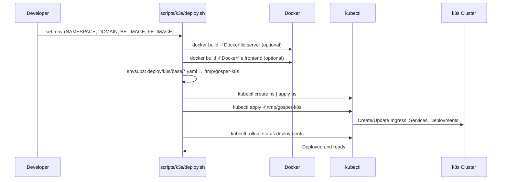

# Deployment (k3s)

> **Note**: For comprehensive deployment guide covering all environments (Docker Compose, AWS, GCP, Azure, CI/CD), see [Complete Deployment Guide](./deployment-complete.md).

## Overview

This guide covers K3s/K8s specific deployment for Gosper.

## Artifacts

- Backend image: `Dockerfile.server` (Go + whisper)
- Frontend image: `Dockerfile.frontend` (nginx serving `web/`)
- Manifests: `deploy/k8s/base` (Namespace, Deployments/Services, Ingress)
- Scripts: `scripts/k3s/deploy.sh`, `scripts/k3s/uninstall.sh`, `scripts/k3s/env.example`

## Prerequisites

- k3s cluster (or k3d)
- kubectl on PATH
- Docker for building images

## Quick Start

### 1. Build Images

```bash
# Build backend
docker build -f Dockerfile.server -t gosper/server:local .

# Build frontend
docker build -f Dockerfile.frontend -t gosper/fe:local .
```

### 2. Configure Environment

```bash
# Copy template
cp scripts/k3s/env.example scripts/k3s/.env

# Edit configuration
vim scripts/k3s/.env
```

Example `.env`:
```bash
export NAMESPACE=gosper
export DOMAIN=gosper.local
export BE_IMAGE=gosper/server:local
export FE_IMAGE=gosper/fe:local
```

### 3. Deploy

```bash
bash scripts/k3s/deploy.sh
```

### 4. Access

```bash
# Add to /etc/hosts if using local domain
echo "127.0.0.1 gosper.local" | sudo tee -a /etc/hosts

# Open browser
open http://gosper.local
```

## Configuration

### Ingress

- Traefik entrypoint `web` used by default
- Set DNS or `/etc/hosts` for `${DOMAIN}`

### Models

- Server downloads models on demand from `MODEL_BASE_URL`
- Or provide local path via request or env `GOSPER_MODEL`

## Cleanup

```bash
bash scripts/k3s/uninstall.sh
```

## Mermaid Diagrams

Traffic Flow (User → Ingress → Services → Pods)

```mermaid
flowchart LR
  U[User Browser] --> DNS[(DNS/Hosts)]
  DNS --> T[Traefik Ingress (k3s)]
  T -->|/| SFE[Service gosper-fe]
  T -->|/api| SBE[Service gosper-be]
  SFE --> PFE[Deployment gosper-fe → Pod/nginx]
  SBE --> PBE[Deployment gosper-be → Pod/server]
  PBE --> SRV[Go server /api/transcribe]
  SRV --> WH[Whisper adapter]
  WH --> CACHE[(Model Cache)]
  SRV -. optional .-> HF[Hugging Face Models]
```

Kubernetes Object Relationships

```mermaid
flowchart TB
  NS[Namespace ${NAMESPACE}] --- ING[Ingress gosper-ingress]
  NS --- FEDEP[Deployment gosper-fe]
  NS --- BEDEP[Deployment gosper-be]
  FEDEP --> FEPO[ReplicaSet/Pods]
  BEDEP --> BEPO[ReplicaSet/Pods]
  NS --- FESVC[Service gosper-fe]
  NS --- BESVC[Service gosper-be]
  FESVC -->|selector app=gosper-fe| FEPO
  BESVC -->|selector app=gosper-be| BEPO
  ING -->|/ → gosper-fe:80| FESVC
  ING -->|/api → gosper-be:80| BESVC
```

Deploy Script Sequence (envsubst + kubectl apply)


