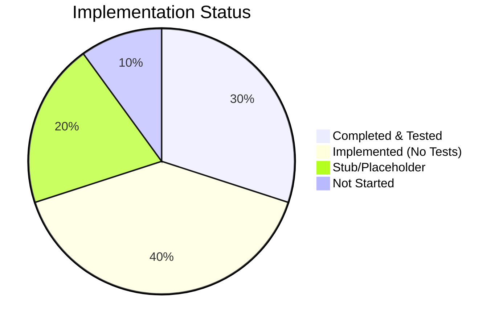
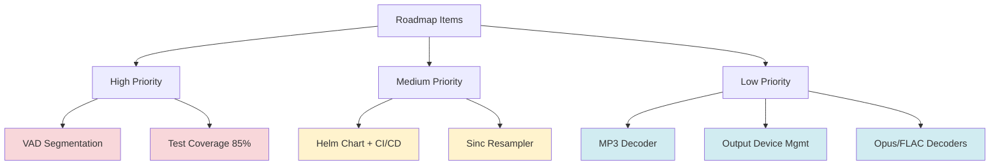
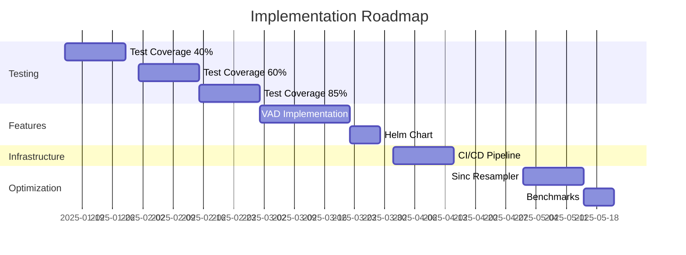

# Technical Debt & Roadmap Analysis

> **Generated**: 2025-01-15
> **Current Coverage**: 29.6%

## Table of Contents

1. [Overview](#overview)
2. [Current Implementation Status](#current-implementation-status)
3. [Incomplete Features](#incomplete-features)
4. [Roadmap Items](#roadmap-items)
5. [Recommendations](#recommendations)

---

## Overview

This document tracks incomplete implementations, TODOs, and planned features in the Gosper codebase.

### Summary



---

## Current Implementation Status

### ✅ Fully Implemented

| Component | Status | Tests | Notes |
|-----------|--------|-------|-------|
| Linear Resampler | ✅ Complete | 100% | Production ready |
| Audio Normalization | ✅ Complete | 100% | Downmix & peak normalize |
| WAV Decoder | ✅ Complete | 18% | Needs more tests |
| Use Cases | ✅ Complete | 82% | Core logic solid |
| Config System | ✅ Complete | 60% | Needs edge case tests |
| Storage | ✅ Complete | 64% | Basic functionality |

### ⚠️ Partially Implemented

| Component | Status | Tests | Issue |
|-----------|--------|-------|-------|
| Model Repository | ⚠️ Partial | 0% | Download/cache works, no tests |
| Audio Selector | ⚠️ Partial | 0% | Fuzzy matching implemented, no tests |
| CLI Commands | ⚠️ Partial | 0% | Functional, no tests |
| HTTP Server | ⚠️ Partial | 0% | Works, no tests |

### 🔴 Stub/Not Implemented

| Component | Status | Tests | Priority |
|-----------|--------|-------|----------|
| MP3 Decoder | 🔴 Stub | 0% | Low |
| VAD Segmentation | 🔴 Not Started | 0% | High |
| Sinc Resampler | 🔴 Not Started | 0% | Medium |
| Output Device Mgmt | 🔴 Not Started | 0% | Low |
| Helm Chart | 🔴 Not Started | N/A | Medium |

---

## Incomplete Features

### 1. MP3 Decoder

**File**: `internal/adapter/outbound/audio/decoder/mp3.go`

**Current Status**:
```go
func NewMP3(path string) (Decoder, error) {
    return nil, fmt.Errorf("mp3 decoding not implemented; please convert to wav")
}
```

**Roadmap Item**: "Extended decoder support (MP3/Opus/FLAC) behind tags"

**Options**:

#### Option A: Implement with go-mp3 library
```go
import "github.com/hajimehoshi/go-mp3"

func NewMP3(path string) (Decoder, error) {
    f, err := os.Open(path)
    if err != nil {
        return nil, err
    }
    d, err := mp3.NewDecoder(f)
    if err != nil {
        f.Close()
        return nil, err
    }
    return &mp3Decoder{file: f, decoder: d}, nil
}
```

#### Option B: Use CGO with libmp3lame
```go
// #cgo LDFLAGS: -lmp3lame
// #include <lame/lame.h>
import "C"
```

#### Option C: Keep as stub, document limitation
- Simplest approach
- Users convert to WAV first
- Reduces dependencies

**Recommendation**: **Option C** (document limitation)
- Most users have WAV files
- Adding MP3 support increases complexity
- Can add later if demand exists

---

### 2. VAD (Voice Activity Detection)

**Status**: Not implemented

**Roadmap Item**: "Always-on mode with VAD segmentation and timestamps"

**Use Case**:
```
┌─────────────────────────────────────────┐
│ Continuous Audio Stream                 │
│ ███░░░███████░░███░░░░░██████░░░███     │
│  ^      ^        ^          ^      ^    │
│  Speech Silence Speech    Speech  Sil  │
└─────────────────────────────────────────┘
                  ↓
        ┌───────────────────┐
        │   VAD Segmenter   │
        └───────────────────┘
                  ↓
    ┌──────┐  ┌──────┐  ┌──────┐
    │ Seg1 │  │ Seg2 │  │ Seg3 │
    └──────┘  └──────┘  └──────┘
```

**Implementation Plan**:

1. **Energy-based VAD** (Simple, good start)
```go
// pkg/vad/energy.go
type EnergyVAD struct {
    Threshold    float32  // Energy threshold
    MinSpeechLen int      // Min samples for speech
    MinSilence   int      // Min silence to split
}

func (v *EnergyVAD) Segment(pcm []float32) []Segment {
    // Calculate short-time energy
    // Find speech/silence boundaries
    // Return segments
}
```

2. **WebRTC VAD** (More accurate)
```go
import "github.com/go-vad/webrtc-vad"

type WebRTCVAD struct {
    vad *webrtc.VAD
}
```

3. **Silero VAD** (Best quality, ML-based)
```go
// Use ONNX runtime to run Silero VAD model
import "github.com/yalue/onnxruntime_go"
```

**Recommendation**: **Phase 1: Energy-based**, **Phase 2: WebRTC**, **Phase 3: Silero**

**Files to Create**:
```
pkg/vad/
├── vad.go          (interface)
├── energy.go       (energy-based implementation)
├── energy_test.go
├── webrtc.go       (optional, behind build tag)
└── webrtc_test.go
```

**Integration**:
```go
// Add to record_and_transcribe.go
type RecordAndTranscribe struct {
    // ... existing fields
    VAD      port.VoiceActivityDetector  // new
}

// Add to ports.go
type VoiceActivityDetector interface {
    Segment(pcm []float32, sampleRate int) []AudioSegment
}

type AudioSegment struct {
    StartTime time.Duration
    EndTime   time.Duration
    PCM       []float32
}
```

**Priority**: 🟡 **Medium** (useful feature, but not critical)

---

### 3. Sinc Resampler

**Status**: Not implemented (only linear resampler exists)

**Roadmap Item**: "Higher-fidelity resampler (sinc) behind tag; benchmarks"

**Current Implementation**:
```go
// internal/adapter/outbound/audio/resample/linear.go
func Linear(in []float32, fromRate, toRate int) []float32 {
    // Simple linear interpolation
}
```

**Limitation**: Linear interpolation causes aliasing for high-frequency content

**Sinc Resampler**:
```go
// internal/adapter/outbound/audio/resample/sinc.go
// +build sinc

func Sinc(in []float32, fromRate, toRate int) []float32 {
    // Windowed sinc interpolation
    // Much higher quality, but slower
}
```

**Trade-offs**:

| Method | Quality | Speed | Use Case |
|--------|---------|-------|----------|
| Linear | Fair | Fast | Default, speech |
| Sinc | Excellent | Slow | Music, high-fidelity |

**Recommendation**: **Implement behind build tag**
- Keep linear as default
- Add sinc with `-tags sinc` for quality-critical use cases
- Benchmark both

**Test Plan**:
```go
func BenchmarkLinear(b *testing.B) {
    pcm := generateTestSignal(48000)
    b.ResetTimer()
    for i := 0; i < b.N; i++ {
        Linear(pcm, 48000, 16000)
    }
}

func BenchmarkSinc(b *testing.B) {
    pcm := generateTestSignal(48000)
    b.ResetTimer()
    for i := 0; i < b.N; i++ {
        Sinc(pcm, 48000, 16000)
    }
}
```

**Priority**: 🟢 **Low** (linear is sufficient for speech)

---

### 4. Output Device Management

**Status**: Stub exists, no management commands

**Roadmap Item**: "Output device management commands and profiles"

**Current**:
```go
// Can select output device for beeps
// No CLI commands to manage devices
```

**Needed**:
```bash
# List output devices
gosper devices output list

# Set default output device
gosper devices output set "Built-in Output"

# Test output device
gosper devices output test "Speakers"
```

**Implementation**:
```go
// internal/adapter/inbound/cli/cmd_devices.go
var devicesOutputCmd = &cobra.Command{
    Use:   "output",
    Short: "Manage output devices",
}

var devicesOutputListCmd = &cobra.Command{
    Use:   "list",
    Short: "List output devices",
    RunE:  listOutputDevices,
}

var devicesOutputSetCmd = &cobra.Command{
    Use:   "set <device>",
    Short: "Set default output device",
    RunE:  setOutputDevice,
}

var devicesOutputTestCmd = &cobra.Command{
    Use:   "test <device>",
    Short: "Play test tone on device",
    RunE:  testOutputDevice,
}
```

**Priority**: 🟢 **Low** (nice-to-have)

---

### 5. Helm Chart & CI/CD

**Status**: No Helm chart, manual deploy scripts only

**Roadmap Item**: "Helm chart and GH Actions image build/push + deploy"

**Current**:
```
deploy/k8s/base/  (raw YAML, needs envsubst)
scripts/k3s/deploy.sh  (shell script)
```

**Needed**:
```
deploy/helm/gosper/
├── Chart.yaml
├── values.yaml
├── templates/
│   ├── deployment-backend.yaml
│   ├── deployment-frontend.yaml
│   ├── service-backend.yaml
│   ├── service-frontend.yaml
│   ├── ingress.yaml
│   └── NOTES.txt
```

**CI/CD** (GitHub Actions):
```yaml
# .github/workflows/deploy.yml
name: Build and Deploy

on:
  push:
    tags:
      - 'v*'

jobs:
  build:
    # Build Docker images
    # Push to GHCR

  deploy:
    needs: build
    # Deploy to k8s via Helm
```

**Priority**: 🟡 **Medium** (improves deployment experience)

---

## Roadmap Items

### Prioritized List



### Timeline

| Quarter | Focus | Deliverables |
|---------|-------|--------------|
| **Q1 2025** | Testing & Quality | - 85% test coverage<br>- CI/CD coverage gates<br>- Bug fixes |
| **Q2 2025** | Features | - VAD segmentation<br>- Helm chart<br>- Better docs |
| **Q3 2025** | Performance | - Sinc resampler<br>- Benchmarks<br>- Optimization |
| **Q4 2025** | Ecosystem | - MP3/Opus support<br>- Output device mgmt<br>- Plugins |

---

## Recommendations

### Immediate Actions (Next 2 Weeks)

1. ✅ **Increase Test Coverage to 40%**
   - Add model repo tests
   - Add storage tests
   - Move tests to packages

2. ✅ **Document Limitations**
   - Update README: "MP3 not supported, convert to WAV"
   - Document VAD as future feature

3. ✅ **Clean Up TODOs**
   - Remove specs/001-handy-go/ (legacy)
   - Remove .codex/ (if not used)

### Short-Term (1-2 Months)

4. **Implement Basic VAD**
   - Energy-based VAD for segmentation
   - Add to `record` command with `--vad` flag

5. **Add Helm Chart**
   - Simplify deployment
   - Add to docs

6. **CI/CD Pipeline**
   - Automated testing
   - Coverage enforcement
   - Docker image builds

### Long-Term (3-6 Months)

7. **Performance Optimization**
   - Sinc resampler
   - Benchmarks
   - Profile and optimize hot paths

8. **Extended Format Support**
   - MP3 (if requested by users)
   - Opus (for efficiency)
   - FLAC (for quality)

9. **Advanced Features**
   - Speaker diarization
   - Real-time transcription streaming
   - Language detection

---

## Action Plan

### Phase 1: Quality (Weeks 1-4)

**Goal**: Solid foundation with 60% test coverage

```bash
# Week 1-2: Reorganize tests
mv test/unit/* internal/*/

# Week 3-4: Add missing tests
# See test-coverage-strategy.md
```

### Phase 2: Features (Weeks 5-8)

**Goal**: VAD + Helm + CI/CD

```bash
# Week 5-6: VAD implementation
mkdir pkg/vad
# Implement energy-based VAD

# Week 7: Helm chart
mkdir -p deploy/helm/gosper

# Week 8: CI/CD
# Update .github/workflows/
```

### Phase 3: Polish (Weeks 9-12)

**Goal**: Production-ready

```bash
# Week 9-10: Performance
# Add sinc resampler
# Benchmarks

# Week 11-12: Documentation
# User guide
# API docs
# Examples
```

---

## Metrics

### Success Criteria

| Metric | Current | Target | Deadline |
|--------|---------|--------|----------|
| Test Coverage | 29.6% | 85% | Q1 2025 |
| CI/CD | Manual | Automated | Q1 2025 |
| Deployment | Scripts | Helm | Q2 2025 |
| VAD | No | Yes | Q2 2025 |
| Format Support | WAV only | WAV+MP3 | Q4 2025 |

### Weekly Tracking



---

## Summary

### Current State
- ✅ Core functionality works
- ⚠️ Test coverage low (29.6%)
- 🔴 Some features stubbed (MP3, VAD)
- 🔴 Manual deployment only

### Priority Order
1. **Test Coverage** (Critical)
2. **VAD Implementation** (High value)
3. **Helm Chart + CI/CD** (DevOps efficiency)
4. **Sinc Resampler** (Quality improvement)
5. **Extended Decoders** (Nice-to-have)

### Next Steps
1. Follow `test-coverage-strategy.md`
2. Implement VAD (energy-based)
3. Create Helm chart
4. Set up CI/CD pipeline

---

**Document Version**: 1.0
**Last Updated**: 2025-01-15
**Owner**: Development Team
