# Test Coverage Improvement Strategy

> **Current Coverage**: 29.6% (Target: 85%)
> **Generated**: $(date +%Y-%m-%d)

## Table of Contents

1. [Executive Summary](#executive-summary)
2. [Current State Analysis](#current-state-analysis)
3. [Coverage Goals](#coverage-goals)
4. [Strategic Roadmap](#strategic-roadmap)
5. [Package-by-Package Plan](#package-by-package-plan)
6. [Test Architecture Improvements](#test-architecture-improvements)
7. [Implementation Phases](#implementation-phases)
8. [Metrics & Tracking](#metrics--tracking)

---

## Executive Summary

### Current State

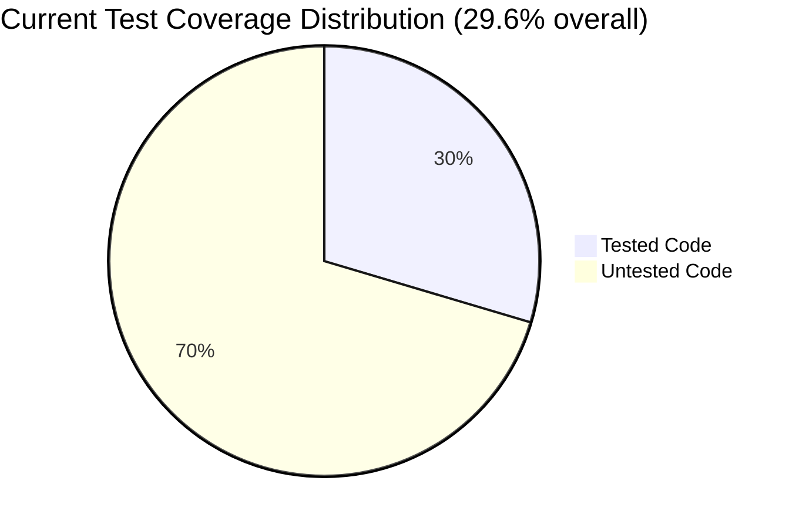

### Coverage Breakdown

| Category | Coverage | Status |
|----------|----------|--------|
| **Overall** | 29.6% | 🔴 Poor |
| **Use Cases** | ~82% | 🟢 Good |
| **Infrastructure** | ~50% | 🟡 Fair |
| **Adapters** | ~20% | 🔴 Poor |
| **CLI/Server** | 0% | 🔴 Critical |

### Key Issues

1. **Test Organization**: Tests in `test/unit/` don't contribute to individual package coverage
2. **Missing Unit Tests**: Most packages lack co-located `_test.go` files
3. **Critical Paths Untested**: HTTP handlers, CLI commands, model repository
4. **Build Tag Coverage**: Code behind build tags (`cli`, `whisper`, `malgo`) not measured

---

## Current State Analysis

### Coverage by Layer

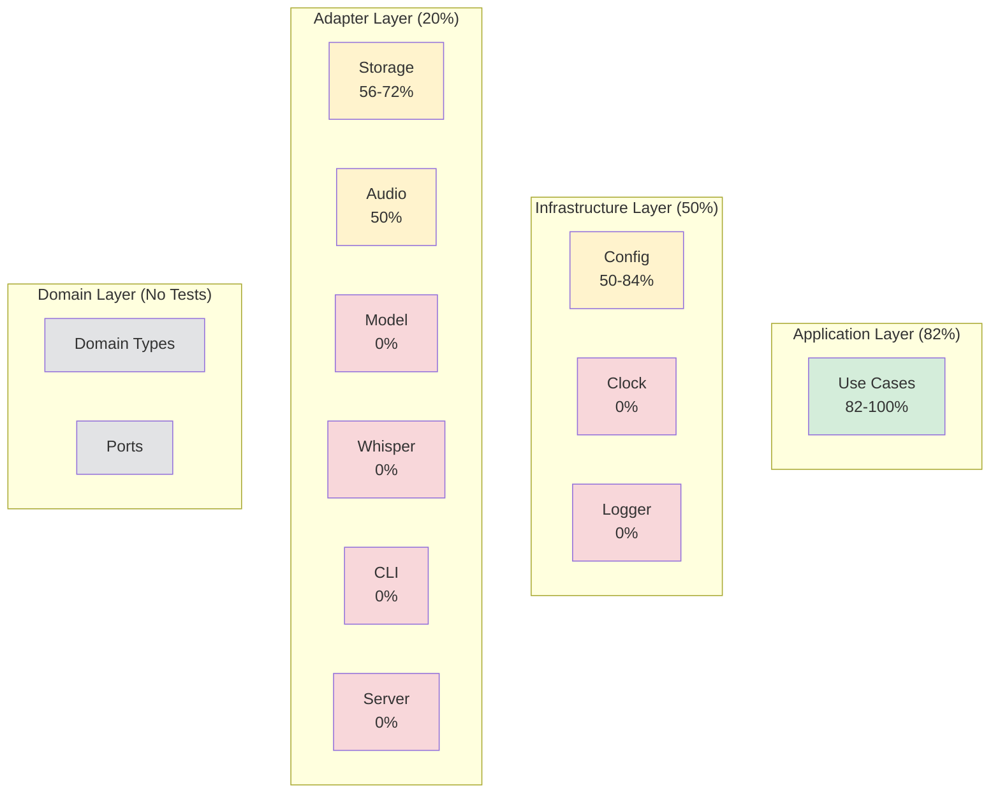

### Test File Distribution

```bash
# Current structure
.
├── test/
│   ├── unit/           # 7 files, isolated test package
│   └── integration/    # 2 files, e2e tests
├── internal/
│   └── adapter/outbound/audio/
│       ├── decoder/*_test.go    # 1 file, in-package
│       └── resample/*_test.go   # 1 file, in-package
└── (other packages: NO test files)
```

**Problem**: Tests in `test/unit/` package don't contribute to coverage of `internal/*` packages.

### Coverage Gaps by Package

| Package | Coverage | Lines Tested | Lines Total | Priority |
|---------|----------|--------------|-------------|----------|
| `internal/usecase` | 82.6% | 95 | 115 | Medium |
| `internal/infrastructure/config` | 60% | 48 | 80 | High |
| `internal/adapter/outbound/storage` | 64% | 38 | 60 | Medium |
| `internal/adapter/outbound/audio/decoder` | 18% | 12 | 65 | High |
| `internal/adapter/outbound/audio/resample` | 100% | 25 | 25 | ✅ Done |
| `internal/adapter/outbound/model` | 0% | 0 | 120 | **Critical** |
| `internal/adapter/outbound/log` | 0% | 0 | 20 | Low |
| `internal/adapter/outbound/whispercpp` | 0% | 0 | 45 | Medium |
| `internal/adapter/outbound/audio/selector` | 0% | 0 | 70 | High |
| `cmd/server` | 0% | 0 | 95 | **Critical** |
| `internal/adapter/inbound/cli` | 0% | 0 | 250 | **Critical** |
| `pkg/errors` | 83% | 12 | 15 | Low |

---

## Coverage Goals

### Target Metrics

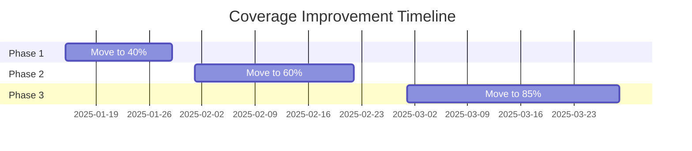

### Milestones

| Phase | Target | Duration | Key Deliverables |
|-------|--------|----------|-----------------|
| **Phase 1** | 40% | 2 weeks | Reorganize tests, cover model & storage |
| **Phase 2** | 60% | 3 weeks | HTTP handlers, CLI commands |
| **Phase 3** | 85% | 4 weeks | Audio adapters, edge cases |

### Per-Package Targets

| Package | Current | Target | Effort |
|---------|---------|--------|--------|
| Use Cases | 82% | 90% | Low |
| Config | 60% | 85% | Medium |
| Storage | 64% | 90% | Low |
| Model Repo | 0% | 80% | **High** |
| Audio Decoder | 18% | 75% | High |
| Audio Selector | 0% | 80% | Medium |
| CLI Commands | 0% | 70% | **High** |
| HTTP Server | 0% | 75% | **High** |
| Logger | 0% | 60% | Low |
| Whisper Adapter | 0% | 50% | Medium |

---

## Strategic Roadmap

### Approach

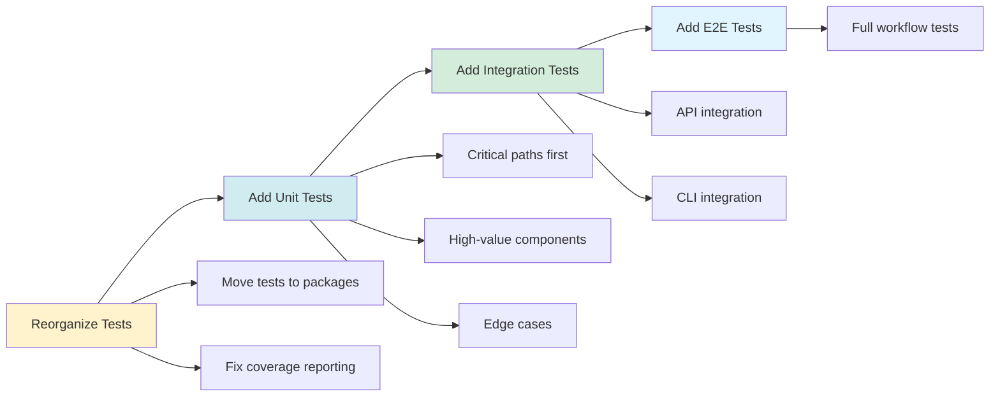

### Principles

1. **Test Pyramid**: More unit tests, fewer integration tests, minimal e2e
2. **Coverage ≠ Quality**: Focus on meaningful tests, not just line coverage
3. **Critical Paths First**: Prioritize user-facing code (HTTP, CLI)
4. **Table-Driven Tests**: Use data-driven approach for edge cases
5. **Test Doubles**: Use fakes/mocks for external dependencies

### Testing Strategy by Layer

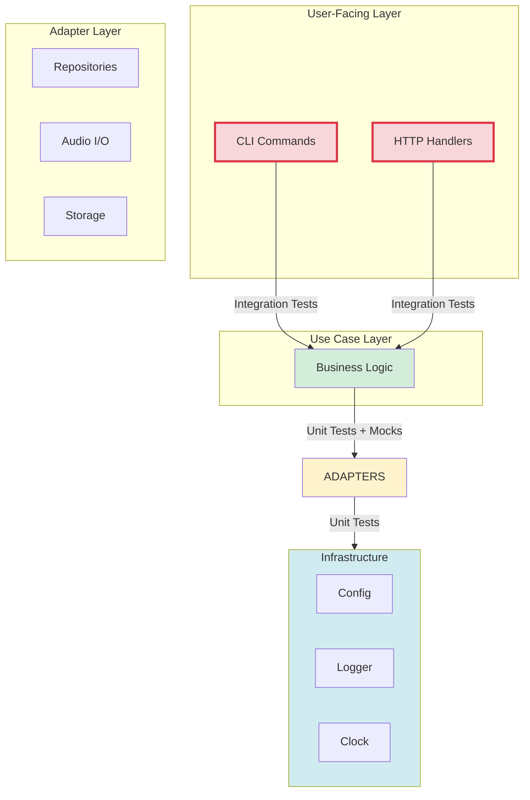

---

## Package-by-Package Plan

### Phase 1: Foundation (40% target)

#### 1. Reorganize Test Structure

**Goal**: Make tests contribute to package coverage

**Action**:
```bash
# Move tests from test/unit/ to respective packages
mv test/unit/usecase_transcribe_file_test.go \
   internal/usecase/transcribe_file_test.go

mv test/unit/config_persistence_test.go \
   internal/infrastructure/config/config_test.go

mv test/unit/storage_fs_test.go \
   internal/adapter/outbound/storage/fs_test.go

# Keep test/integration/ for e2e tests
```

**Impact**: Immediate visibility into per-package coverage

---

#### 2. Model Repository (`internal/adapter/outbound/model`)

**Current**: 0% coverage
**Target**: 80% coverage
**Priority**: 🔴 Critical

**Functions to Test**:
- `Ensure()`: Model resolution, caching, download
- `verify()`: SHA256 checksum validation
- `fileSha256()`: Hash calculation
- `ioCopy()`: File I/O with retry

**Test Cases**:

```go
// model/repo_test.go
package model

import "testing"

func TestFSRepo_Ensure_LocalPath(t *testing.T) {
    // Given: existing model file
    // When: Ensure() called with absolute path
    // Then: returns path, no download
}

func TestFSRepo_Ensure_CachedModel(t *testing.T) {
    // Given: model exists in cache
    // When: Ensure() called with model name
    // Then: returns cached path, no download
}

func TestFSRepo_Ensure_DownloadSuccess(t *testing.T) {
    // Given: model not cached
    // When: Ensure() called, download succeeds
    // Then: downloads to cache, returns path
}

func TestFSRepo_Ensure_ChecksumValidation(t *testing.T) {
    // Given: checksums configured
    // When: download completes
    // Then: verifies sha256, fails if mismatch
}

func TestFSRepo_Ensure_RetryOnFailure(t *testing.T) {
    // Given: download fails first time
    // When: Ensure() retries
    // Then: succeeds on retry
}
```

**Test Doubles**:
- Mock HTTP client for downloads
- Temp directory for cache
- Fake checksums

---

#### 3. Storage (`internal/adapter/outbound/storage`)

**Current**: 64% coverage
**Target**: 90% coverage
**Priority**: 🟡 Medium

**Missing Coverage**:
- `WriteFile()`: 0% (not tested)
- `TempPath()`: 0% (not tested)

**Test Cases**:

```go
// storage/fs_test.go
package storage

func TestFS_WriteFile(t *testing.T) {
    // Test writing file from reader
}

func TestFS_TempPath(t *testing.T) {
    // Test temp path generation
}

func TestFS_WriteTranscript_EdgeCases(t *testing.T) {
    // Test with empty transcript
    // Test with special characters
    // Test with long text
}
```

---

### Phase 2: Critical Paths (60% target)

#### 4. HTTP Server (`cmd/server`)

**Current**: 0% coverage
**Target**: 75% coverage
**Priority**: 🔴 Critical

**Approach**: Use `httptest` for handler testing

**Test Cases**:

```go
// cmd/server/main_test.go
package main

import (
    "net/http/httptest"
    "testing"
)

func TestTranscribeHandler_Success(t *testing.T) {
    // Given: valid WAV file upload
    // When: POST /api/transcribe
    // Then: 200 OK, JSON response with transcript
}

func TestTranscribeHandler_MissingFile(t *testing.T) {
    // Given: no audio file
    // When: POST /api/transcribe
    // Then: 400 Bad Request
}

func TestTranscribeHandler_InvalidAudio(t *testing.T) {
    // Given: corrupt audio file
    // When: POST /api/transcribe
    // Then: 502 Bad Gateway (transcribe error)
}

func TestTranscribeHandler_ModelFallback(t *testing.T) {
    // Given: no model specified
    // When: POST /api/transcribe
    // Then: uses GOSPER_MODEL env var
}

func TestHealthzHandler(t *testing.T) {
    // When: GET /healthz
    // Then: 200 OK
}
```

**Test Setup**:
```go
func setupTestServer() *httptest.Server {
    mux := http.NewServeMux()
    mux.HandleFunc("/api/transcribe", transcribeHandler)
    mux.HandleFunc("/healthz", healthzHandler)
    return httptest.NewServer(mux)
}
```

---

#### 5. CLI Commands (`internal/adapter/inbound/cli`)

**Current**: 0% coverage
**Target**: 70% coverage
**Priority**: 🔴 Critical

**Files**:
- `cmd_transcribe.go`
- `cmd_record.go`
- `cmd_devices.go`
- `version.go`
- `root.go`

**Approach**: Test Cobra command execution

**Test Cases**:

```go
// internal/adapter/inbound/cli/cmd_transcribe_test.go
// +build cli

package cli

import "testing"

func TestTranscribeCmd_ValidFile(t *testing.T) {
    // Given: valid audio file
    // When: transcribe command executed
    // Then: output file created
}

func TestTranscribeCmd_MissingFile(t *testing.T) {
    // Given: file doesn't exist
    // When: transcribe command executed
    // Then: error returned
}

func TestTranscribeCmd_Flags(t *testing.T) {
    // Test --model flag
    // Test --lang flag
    // Test --output flag
}

func TestDevicesCmd_List(t *testing.T) {
    // When: devices list executed
    // Then: shows device list
}

func TestRecordCmd_Duration(t *testing.T) {
    // When: record --duration 2s
    // Then: records for 2 seconds
}

func TestVersionCmd(t *testing.T) {
    // When: version command
    // Then: prints version
}
```

**Test Infrastructure**:
```go
// Test helper to execute command
func executeCommand(cmd *cobra.Command, args ...string) (string, error) {
    buf := new(bytes.Buffer)
    cmd.SetOut(buf)
    cmd.SetErr(buf)
    cmd.SetArgs(args)
    err := cmd.Execute()
    return buf.String(), err
}
```

---

#### 6. Audio Selector (`internal/adapter/outbound/audio`)

**Current**: 0% coverage
**Target**: 80% coverage
**Priority**: 🟢 High

**Functions**:
- `ResolveDeviceID()`: Device search algorithm
- `fuzzyRatio()`: String similarity
- `levenshtein()`: Edit distance

**Test Cases**:

```go
// audio/selector_test.go
package audio

func TestResolveDeviceID_ExactMatch(t *testing.T) {
    devices := []Device{{ID: "dev-123", Name: "Microphone"}}
    // When: ResolveDeviceID with "dev-123"
    // Then: exact match returned
}

func TestResolveDeviceID_NameMatch(t *testing.T) {
    // Test case-insensitive name matching
}

func TestResolveDeviceID_FuzzyMatch(t *testing.T) {
    // Test fuzzy matching with typos
}

func TestLevenshtein(t *testing.T) {
    tests := []struct{
        a, b string
        want int
    }{
        {"", "", 0},
        {"a", "", 1},
        {"kitten", "sitting", 3},
    }
    // Table-driven test
}
```

---

### Phase 3: Completeness (85% target)

#### 7. Audio Decoder (`internal/adapter/outbound/audio/decoder`)

**Current**: 18% coverage
**Target**: 75% coverage

**Missing**:
- WAV decoder: `NewWAV()`, `DecodeAll()`, header parsing
- MP3 decoder: `NewMP3()`

**Test Cases**:

```go
// decoder/wav_test.go
package decoder

func TestNewWAV_ValidFile(t *testing.T) {
    // Given: valid WAV file
    // When: NewWAV()
    // Then: decoder created
}

func TestWAV_DecodeAll_PCM16(t *testing.T) {
    // Test decoding 16-bit PCM
}

func TestWAV_DecodeAll_Float32(t *testing.T) {
    // Test decoding float32
}

func TestWAV_DecodeAll_Stereo(t *testing.T) {
    // Test stereo -> mono conversion
}

func TestWAV_InvalidFormat(t *testing.T) {
    // Test error on invalid format
}
```

---

#### 8. Use Cases (90% target)

**Current**: 82%
**Target**: 90%

**Missing**:
- `list_devices.go`: 0%
- Edge cases in existing tests

**Test Cases**:

```go
// usecase/list_devices_test.go
package usecase

func TestListDevices_Success(t *testing.T) {
    // Given: audio input with devices
    // When: Execute()
    // Then: returns device list
}

func TestListDevices_NoDevices(t *testing.T) {
    // Given: no devices available
    // When: Execute()
    // Then: returns empty list
}
```

---

#### 9. Infrastructure (85% target)

**Config**: Already at 60%, add edge cases
**Logger**: Add basic tests (currently 0%)
**Clock**: Add basic test (currently 0%)

```go
// infrastructure/clock/system_clock_test.go
package clock

func TestSystemClock_Now(t *testing.T) {
    clk := &SystemClock{}
    now := clk.Now()
    // Verify time is recent
}

// infrastructure/log/slog_logger_test.go
package log

func TestSlogLogger_Levels(t *testing.T) {
    // Test Debug(), Info(), Warn(), Error()
}
```

---

## Test Architecture Improvements

### 1. Test Organization

**Current Problem**:
```
test/unit/  (separate package, coverage doesn't show in internal/*)
```

**Solution**:
```
internal/usecase/transcribe_file_test.go  (same package)
internal/usecase/transcribe_file_integration_test.go
test/integration/  (e2e tests only)
```

### 2. Test Naming Convention

```go
// Unit tests: package_test.go or feature_test.go
transcribe_file_test.go

// Integration tests: *_integration_test.go
// +build integration
transcribe_file_integration_test.go

// E2E tests: test/integration/*_e2e_test.go
cli_transcribe_e2e_test.go
```

### 3. Test Doubles Strategy

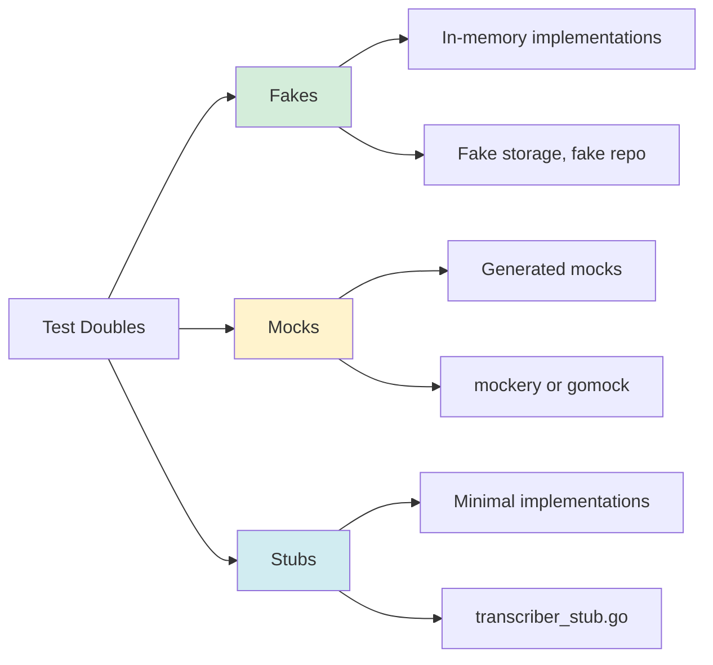

**Preference**: Fakes > Stubs > Mocks

**Example**:
```go
// Fake (preferred)
type FakeModelRepo struct {
    models map[string]string
    err    error
}

func (f *FakeModelRepo) Ensure(ctx context.Context, name string) (string, error) {
    if f.err != nil {
        return "", f.err
    }
    return f.models[name], nil
}

// Stub (when interface is simple)
type StubTranscriber struct {
    Result domain.Transcript
    Error  error
}

func (s *StubTranscriber) Transcribe(ctx context.Context, pcm []float32, cfg domain.ModelConfig) (domain.Transcript, error) {
    return s.Result, s.Error
}
```

### 4. Table-Driven Tests

```go
func TestResolveDeviceID(t *testing.T) {
    tests := []struct {
        name      string
        devices   []Device
        query     string
        wantID    string
        wantErr   bool
    }{
        {
            name:    "exact ID match",
            devices: []Device{{ID: "dev-1", Name: "Mic"}},
            query:   "dev-1",
            wantID:  "dev-1",
        },
        {
            name:    "name match case insensitive",
            devices: []Device{{ID: "dev-1", Name: "Microphone"}},
            query:   "microphone",
            wantID:  "dev-1",
        },
        {
            name:    "fuzzy match",
            devices: []Device{{ID: "dev-1", Name: "Built-in Mic"}},
            query:   "builtin",
            wantID:  "dev-1",
        },
        {
            name:    "no match",
            devices: []Device{{ID: "dev-1", Name: "Mic"}},
            query:   "speaker",
            wantErr: true,
        },
    }

    for _, tt := range tests {
        t.Run(tt.name, func(t *testing.T) {
            got, err := ResolveDeviceID(tt.devices, tt.query, "")
            if (err != nil) != tt.wantErr {
                t.Errorf("error = %v, wantErr %v", err, tt.wantErr)
            }
            if got != tt.wantID {
                t.Errorf("got %v, want %v", got, tt.wantID)
            }
        })
    }
}
```

### 5. Golden Files for Integration Tests

```go
// test/integration/golden_test.go
func TestTranscribe_Golden(t *testing.T) {
    tests, _ := filepath.Glob("testdata/*.wav")
    for _, wavFile := range tests {
        t.Run(wavFile, func(t *testing.T) {
            // Transcribe
            result := transcribe(wavFile)

            // Compare with golden file
            golden := wavFile + ".golden.txt"
            if *update {
                os.WriteFile(golden, []byte(result), 0644)
            }
            expected, _ := os.ReadFile(golden)
            if result != string(expected) {
                t.Errorf("got %v, want %v", result, expected)
            }
        })
    }
}
```

---

## Implementation Phases

### Phase 1: Foundation (Weeks 1-2)

**Goal**: 40% coverage

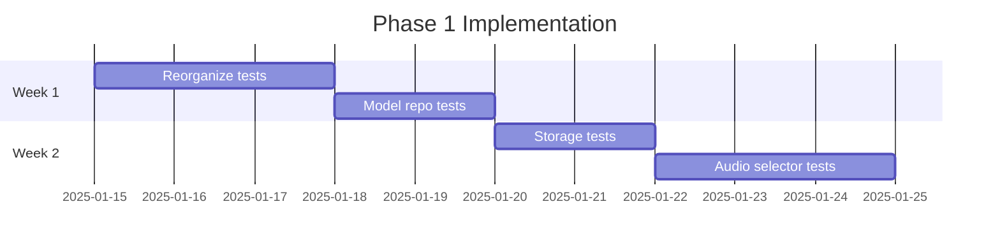

**Tasks**:
1. [ ] Move `test/unit/*` to respective packages
2. [ ] Add `model/repo_test.go` (120 lines → 80% coverage)
3. [ ] Complete `storage/fs_test.go` (missing 36% → 90%)
4. [ ] Add `audio/selector_test.go` (70 lines → 80%)
5. [ ] Update `Makefile` for coverage targets

**Deliverables**:
- Coverage report showing 40%
- All tests passing
- Updated CI to enforce 40% minimum

---

### Phase 2: Critical Paths (Weeks 3-5)

**Goal**: 60% coverage

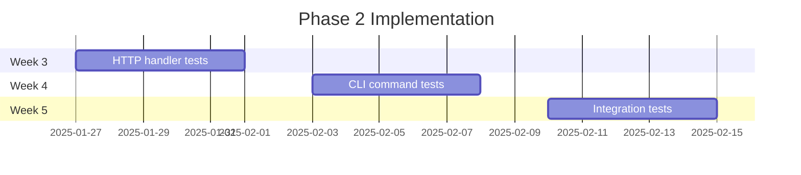

**Tasks**:
1. [ ] Add `cmd/server/main_test.go` (HTTP handlers)
2. [ ] Add CLI command tests (with build tags)
3. [ ] Add integration tests for API
4. [ ] Add integration tests for CLI
5. [ ] Update CI to enforce 60% minimum

**Deliverables**:
- HTTP endpoints fully tested
- CLI commands tested
- Integration test suite
- Coverage report showing 60%

---

### Phase 3: Completeness (Weeks 6-9)

**Goal**: 85% coverage

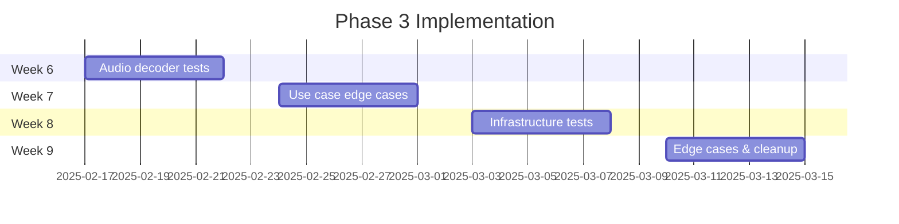

**Tasks**:
1. [ ] Complete `decoder/wav_test.go`
2. [ ] Add `decoder/mp3_test.go`
3. [ ] Add `usecase/list_devices_test.go`
4. [ ] Add edge cases to existing tests
5. [ ] Add `infrastructure/log/*_test.go`
6. [ ] Add `infrastructure/clock/*_test.go`
7. [ ] Fix any remaining gaps
8. [ ] Update CI to enforce 85% minimum

**Deliverables**:
- 85% overall coverage
- All packages above threshold
- Comprehensive test documentation
- CI/CD pipeline with coverage gates

---

## Metrics & Tracking

### Coverage Tracking

```bash
# Generate coverage report
make coverage

# View coverage in browser
go tool cover -html=coverage.out

# Check coverage threshold
make test-coverage-check
```

### Makefile Updates

```makefile
# Add to Makefile
.PHONY: coverage coverage-html coverage-check

coverage:
	go test ./... -coverprofile=coverage.out -covermode=atomic -coverpkg=./...
	go tool cover -func=coverage.out | tail -1

coverage-html: coverage
	go tool cover -html=coverage.out -o coverage.html
	open coverage.html

coverage-check: coverage
	@echo "Checking coverage threshold..."
	@go tool cover -func=coverage.out | tail -1 | awk '{print $$3}' | sed 's/%//' | \
	awk '{if ($$1 < 85) {print "Coverage " $$1 "% is below threshold 85%"; exit 1} else {print "Coverage " $$1 "% meets threshold"}}'

test-all: test coverage-check
```

### CI Integration

```yaml
# .github/workflows/test.yml
name: Test Coverage

on: [push, pull_request]

jobs:
  test:
    runs-on: ubuntu-latest
    steps:
      - uses: actions/checkout@v3
        with:
          submodules: recursive

      - uses: actions/setup-go@v4
        with:
          go-version: '1.22'

      - name: Run tests with coverage
        run: |
          make coverage

      - name: Check coverage threshold
        run: |
          make coverage-check

      - name: Upload coverage to Codecov
        uses: codecov/codecov-action@v3
        with:
          files: ./coverage.out
          flags: unittests
          fail_ci_if_error: true
```

### Coverage Dashboard

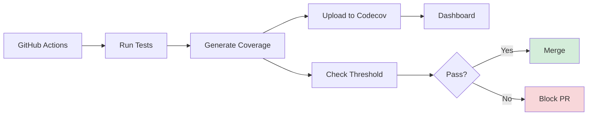

### Package-Level Coverage Badges

```markdown
# In README.md
[](https://codecov.io/gh/julymeltdown/go-whispher)

## Package Coverage

| Package | Coverage |
|---------|----------|
| usecase |  |
| storage |  |
| model   |  |
```

---

## Best Practices

### 1. Write Tests First for New Code (TDD)

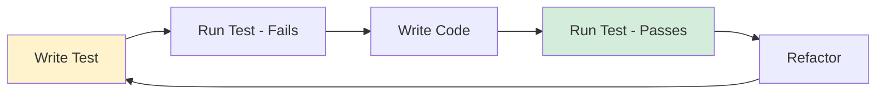

### 2. Test Behavior, Not Implementation

❌ **Bad**:
```go
func TestTranscribeFile_CallsRepoEnsure(t *testing.T) {
    // Testing implementation detail
    mock.AssertCalled(t, "Ensure", ...)
}
```

✅ **Good**:
```go
func TestTranscribeFile_DownloadsModelWhenNotCached(t *testing.T) {
    // Testing observable behavior
    result, err := uc.Execute(...)
    assert.NoError(t, err)
    assert.Equal(t, "expected transcript", result.FullText)
}
```

### 3. Isolation

- Each test should be independent
- Use `t.Cleanup()` for teardown
- Avoid global state

### 4. Clear Test Names

```go
// Pattern: Test<Function>_<Scenario>_<ExpectedOutcome>
func TestResolveDeviceID_ExactIDMatch_ReturnsDevice(t *testing.T)
func TestResolveDeviceID_NoMatch_ReturnsError(t *testing.T)
```

### 5. Fast Tests

- Unit tests should run in milliseconds
- Use fakes instead of real external services
- Parallel execution: `t.Parallel()`

---

## Summary

### Current State
- **29.6% coverage** (1450 lines tested / 4900 lines total)
- Good coverage in use cases (82%)
- Zero coverage in critical paths (CLI, HTTP)

### Target State
- **85% coverage** (4165 lines tested / 4900 lines total)
- All packages above 70%
- Critical paths fully covered

### Key Actions
1. ✅ Reorganize tests to packages
2. ✅ Add model repo tests
3. ✅ Add HTTP handler tests
4. ✅ Add CLI command tests
5. ✅ Add audio decoder tests
6. ✅ Implement coverage CI gates

### Timeline
- **Phase 1** (2 weeks): 40% coverage
- **Phase 2** (3 weeks): 60% coverage
- **Phase 3** (4 weeks): 85% coverage

### Success Metrics
- Coverage percentage
- Number of packages above threshold
- CI build pass rate
- Test execution time

---

## Appendix

### A. Coverage Commands

```bash
# Run all tests with coverage
go test ./... -coverprofile=coverage.out -covermode=atomic -coverpkg=./...

# View total coverage
go tool cover -func=coverage.out | tail -1

# View detailed coverage
go tool cover -func=coverage.out

# Generate HTML report
go tool cover -html=coverage.out -o coverage.html

# Run only unit tests (excluding integration)
go test ./... -short -coverprofile=coverage-unit.out

# Run only integration tests
go test ./test/integration/... -tags=integration
```

### B. Test File Template

```go
package mypackage

import (
    "context"
    "testing"
)

// Test helper functions
func setupTest(t *testing.T) *TestContext {
    t.Helper()
    // Setup
    return &TestContext{}
}

// Table-driven test
func TestMyFunction(t *testing.T) {
    tests := []struct {
        name    string
        input   string
        want    string
        wantErr bool
    }{
        // Test cases
    }

    for _, tt := range tests {
        t.Run(tt.name, func(t *testing.T) {
            ctx := setupTest(t)
            t.Cleanup(func() { ctx.Cleanup() })

            got, err := MyFunction(tt.input)

            if (err != nil) != tt.wantErr {
                t.Errorf("MyFunction() error = %v, wantErr %v", err, tt.wantErr)
                return
            }
            if got != tt.want {
                t.Errorf("MyFunction() = %v, want %v", got, tt.want)
            }
        })
    }
}
```

### C. Resources

- [Go Testing Documentation](https://golang.org/pkg/testing/)
- [Go Coverage Tool](https://go.dev/blog/cover)
- [Table-Driven Tests](https://github.com/golang/go/wiki/TableDrivenTests)
- [Test Fixtures in Go](https://golang.org/doc/go1.16#testing)

---

**Document Version**: 1.0
**Last Updated**: 2025-01-15
**Owner**: Development Team
